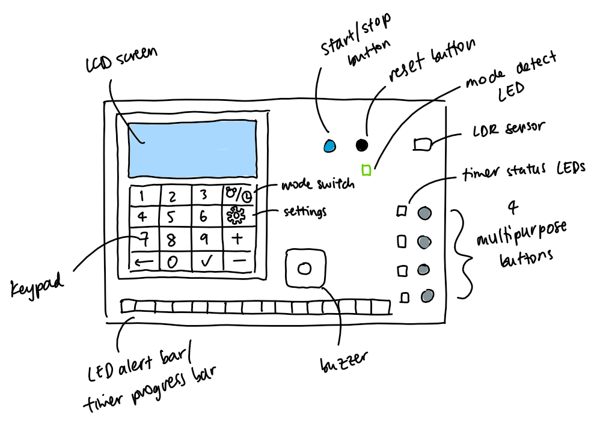

# User Guide
## Table of Contents
- [Introduction](#introduction)
- [Safety Information](#safety-information)
- [Device Overview](#device-overview)
- [Setup Instructions](#setup-instructions)
- [Operating Instructions](#operating-instructions)
  - [Standard Operations](#standard-operations)
  - [Advanced Features](#advanced-features)
- [Support and Contact Information](#support-and-contact-information)
- [Appendices](#appendices)

## Introduction
Welcome to the User Guide for the LabSync Customisable Laboratory Timer. This guide is designed to help you make the most of your new timer, whether you're setting up, operating, or troubleshooting the device. Our laboratory timer is a precise and reliable tool crafted to meet the rigorous demands of scientific research and laboratory work. 
The focus of the LabSync timer pod is creating a configurable lab timer which could run multiple timers simultaneously and provide standard clock functionality.

### How to use this User Guide
This user guide is organised to provide clear and concise information on the LabSync's features and operations. It is structured as follows:

Safety Information: Important guidelines to ensure safe operation.
Device Overview: An introduction to the timer’s components and features.
Setup Instructions: Steps to get your timer up and running.
Operating Instructions: Detailed instructions on how to use the timer.
Support and Contact Information: How to get additional help if needed.

We hope you find this guide helpful. If you have any questions or need further assistance, please refer to the Support and Contact Information section at the end of this document.

## Safety Information
### General Safety Warnings
- Keep Dry: Ensure the device is kept dry. Exposure to water or other liquids can damage the electronic components and cause an electric shock hazard.
- Avoid Extreme Conditions: Do not use the timer in extremely hot, cold, humid, or dusty environments.
### Electrical Safety
- Power Supply: Only use the provided power supply to operate the timer. Using an incompatible power source can damage the device and may cause a fire hazard.
- Disconnect When Not in Use: To avoid the risk of electric shock, unplug the power supply and USB cable when the device is not in use or before cleaning.
### Handling and Storage Precautions
- Handle with Care: Handle the timer, keypad, LCD screen, switches, LEDs, and LED bar with care. Rough handling can damage the components.
- Avoid Heavy Loads: Do not place heavy objects on top of the timer or its components.
- Storage Conditions: Store the timer in a cool, dry place when not in use. Avoid exposure to direct sunlight and extreme temperatures.
### Environmental Conditions
- Temperature: Operate the timer within the specified temperature range (typically 0°C to 40°C). Using the timer outside this range can affect its performance and longevity.
- Humidity: Keep the timer in an environment with relative humidity between 20% and 80%. Excessive moisture can cause damage to electronic components.
### Keypad and Switches
- Gentle Use: Press the keypad buttons and switches gently. Excessive force can damage the input mechanisms.
- Cleaning: If cleaning is necessary, use a soft, dry cloth. Avoid using liquid cleaners or sprays directly on the keypad, switches, or LCD screen.
### LCD Screen and LEDs
- Avoid Direct Sunlight: Prolonged exposure to direct sunlight can damage the LCD screen.
- Brightness: The LEDs and LED bar can be bright; avoid looking directly at them for extended periods to prevent eye strain.

## Device Overview

image of board with annotations

talk about swtiches and what they look like on the board
- Diagram of the Timer: Labeled diagram showing buttons, display, ports, etc.
- List of Components: What’s included in the package.
- Description of Features: Brief description of each feature.
FINISH

## Setup Instructions
- Unpacking the Device: Steps to safely unpack the timer.
- Initial Inspection: Checking for any damage or missing parts.
- Powering the Device: How to connect to a power source.
- Calibration: Steps to calibrate the timer if required.
FINISH

## Operating Instructions
### Standard Operations
This section provides instructions on how to use the LabSync's standard operations.

#### Getting Started
SW1 &rarr; Allows switching between the standard clock mode and the customisable laboratory timer mode. 
SW2 &rarr; Allows switching between each sub mode when you're in either of the main modes.

If you're in the standard clock mode, you can switch between:
- [Clock](#clock)
- [Alarm](#alarm)
- [Standard timer](#standard-timer)
- [Stopwatch](#stopwatch)

If you're in the custom timer mode, you can switch between:
- Timer 1
- Timer 2
- Timer 3
- Timer 4

SW3 &rarr; Allows switching between configuration modes and display modes.

#### Clock
****Annotated image here

##### Configuring the clock
After connecting your device and setting it up correctly, to configure the clock
- If not already in the standard clock mode, press SW1 once to switch to the standard clock mode
- Press SW3 once to switch to the configuration mode

Once you're in configuration mode, using the keypad:
- 'A' increments the selection
- 'B' decrements the selection
- 'C' moves back an element (e.g from month to day)
- 'D' moves forward an element (e.g from day to month)

   The order of elements is:
   1. Day
   2. Month
   3. Year
   4. Seconds
   5. Minutes
   6. Hours
   7. Day of the week

Pressing 'D' when you are on the last element checks if all the data entered is valid and then sets up the clock, time and date if valid. If not valid, the current time and date do not get updated.

##### Displaying the clock
Once the entered time and date are validated, the clock switches from configuration mode to display mode automatically. In this mode, you should see the date and current time displayed on the screen.

To edit the clock's date and time again, simply press SW3 to enter configuration mode.

#### Alarm
****Annotated images here

##### Configuring the alarm
After connecting your device and setting it up correctly, to configure the clock
- If not already in the standard clock mode, press SW1 to switch to the standard clock mode
- Press SW2 once to change from clock mode to alarm mode
- Press SW3 once to switch to the configuration mode

Once you're in configuration mode, you will be asked to enter hours, minutes and seconds in that order. To move from one element to the next, press the '#' on the keypad. 

##### Displaying the alarm
Once the last element is entered and the '#' key is pressed, the alarm switches automatically from configuration mode to display mode. In this mode, you should see 'Alarm' on the LCD, and the display mode contains four features:
1. Enable an existing disabled alarm &rarr; Press 'A' on the keypad
2. Disable an existing alarm &rarr; Press 'B' on the keypad
3. Stop the alarm &rarr; Press 'C' on the keypad
4. Snooze the alarm &rarr; Press 'D' on the keypad

*Note: These features can only be used in the Alarm display mode.

Once the alarm is complete, you will be notified by a buzzer and an LED lighting up on the board for a short period of time. The buzzer and LED turns off automatically after some time.

#### Standard Timer
****Annotated images here

##### Configuring the standard timer
After connecting your device and setting it up correctly, to configure the standard timer
- If not already in the standard clock mode, press SW1 to switch to the standard clock mode
- Press SW2 twice to change from clock mode to standard clock timer mode
- Press SW3 once to switch to the configuration mode

Once you're in configuration mode:
- Use the numbers on the keypad to enter your input
- Input is read in an HHMMSS format (H - hours, M - minutes, S - seconds)
- Once the input is entered, it is also displayed on the LCD

*Note: Timer cannot be shorter than 30 seconds and longer than 1 hour.

##### Displaying the standard timer
To move from the configuration mode to the display mode, press the '#' key on the keypad.

In the display mode:
- '#' &rarr; Starts and stops the timer
- '*' &rarr; Resets the timer to the configured time

To change the timer, switch to the configuration mode by pressing SW3 again.

#### Stopwatch 
****Annotated image here

After connecting your device and setting it up correctly, to use the stopwatch feature
- If not already in the standard clock mode, press SW1 to switch to the standard clock mode
- Press SW2 three times to change from clock mode to stopwatch mode

Once you're in the stopwatch mode:
- '#' &rarr; Starts and stops the timer
- '*' &rarr; Resets stopwatch to 00:00:00

### Advanced Features
FANCY TIMERS
FINISH

## Support and Contact Information
maybe????